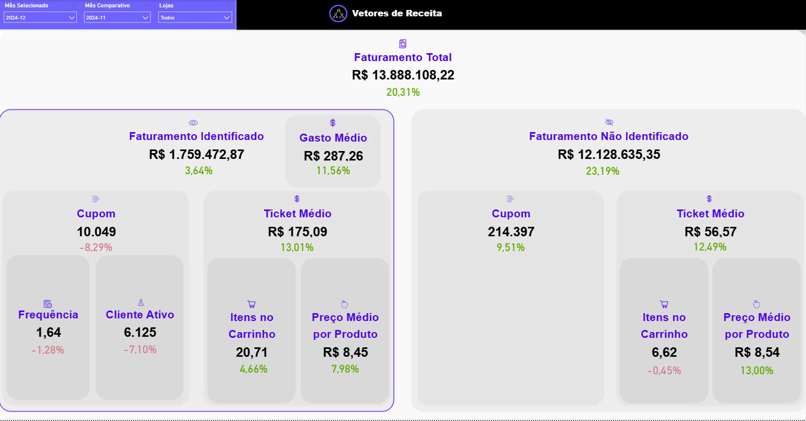
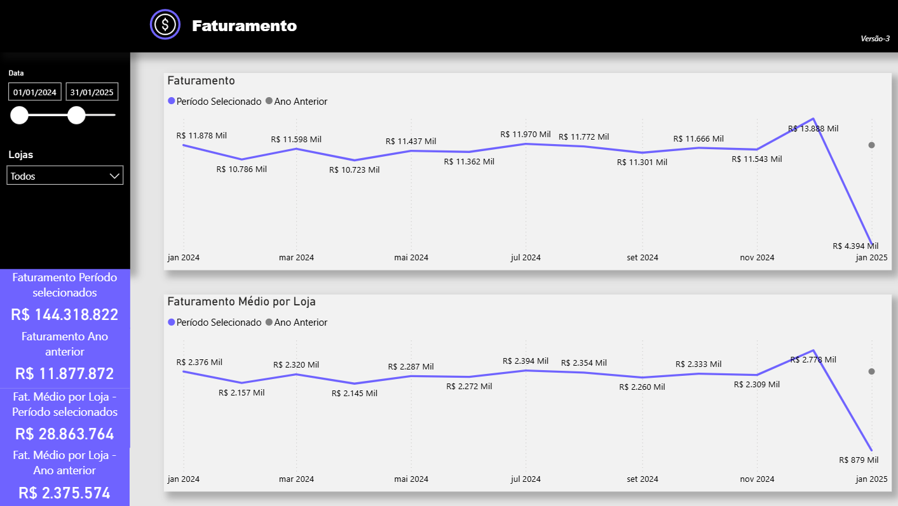
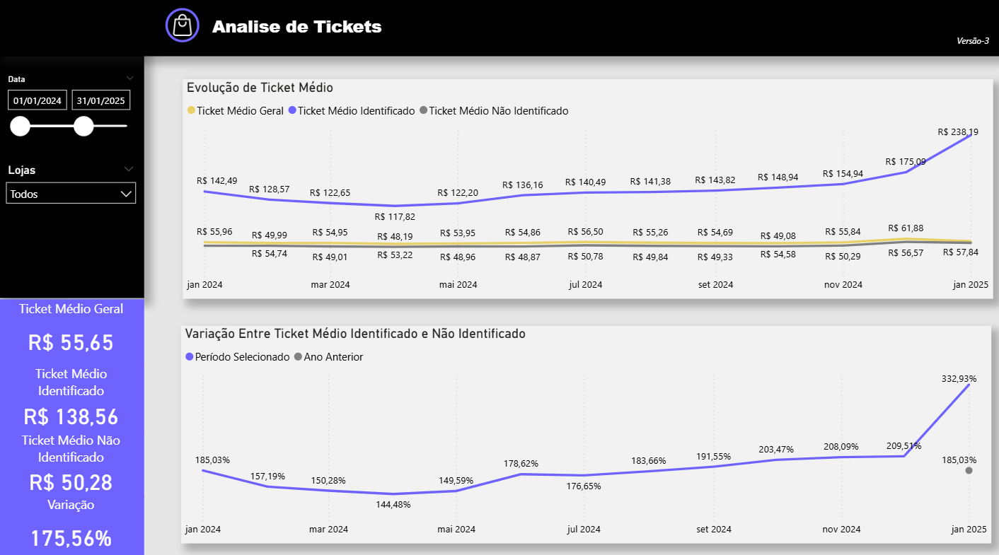
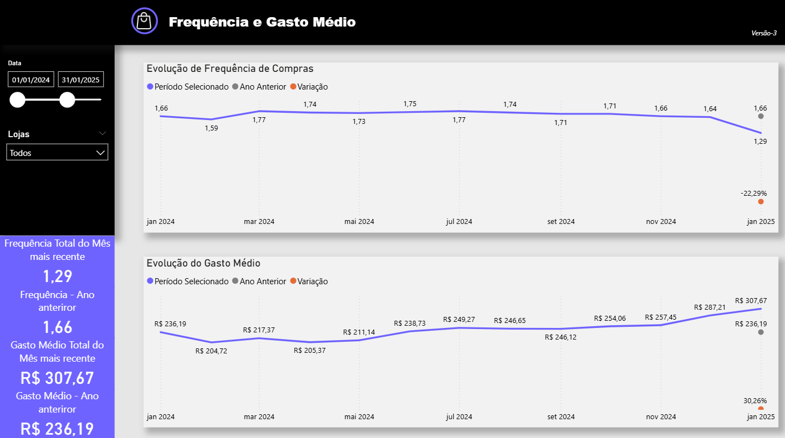
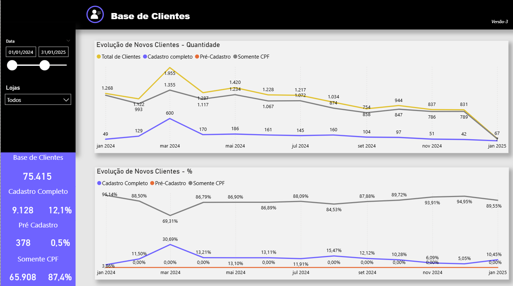

# 📊 Portfólio – Análise de Dados (Power BI + SQL)

Este repositório apresenta um **case real de análise de dados** com foco em desempenho comercial e comportamento de clientes no varejo alimentar.

O projeto foi desenvolvido utilizando **PostgreSQL para extração dos dados**, **Power BI para modelagem, métricas e visualização**, e contempla **regras de negócio reais**, atualização incremental e análises comparativas.

---

## 🎯 Objetivo do Projeto

Fornecer uma visão executiva e analítica sobre:

* Faturamento e sua evolução temporal
* Diferença de comportamento entre vendas identificadas e não identificadas
* Ticket médio, frequência de compra e gasto médio
* Crescimento e perfil da base de clientes

O dashboard foi pensado para apoiar **decisões estratégicas** de negócio, como ações de fidelização, precificação e aumento de recorrência.

---

## 🗄️ Fonte de Dados

* Banco de dados relacional **PostgreSQL**
* Dados anonimizados de vendas, clientes, frequência e lojas
* Extração realizada via SQL, com regras de negócio aplicadas na camada de dados

📁 As queries utilizadas estão disponíveis em:

```
/sql/selects_extracao.sql
```

Destaques técnicos:

* Uso de `date_trunc` para janelas temporais
* Atualização incremental no Power BI utilizando `@RangeStart` e `@RangeEnd`
* Tratamento específico de quantidades para itens pesáveis

---

## 📊 Visões do Dashboard

### 📈 Visão Geral – Vetores de Receita

Consolidação dos principais KPIs do período selecionado, com comparação direta ao período anterior.

Principais análises:

* Faturamento total
* Participação de vendas identificadas vs não identificadas
* Impacto de ticket médio, frequência e itens no carrinho

📷 

---

### 💰 Faturamento – Período x Ano Anterior

Análise da evolução do faturamento ao longo do tempo, permitindo identificar sazonalidade, crescimento e quedas relevantes.

Objetivo:

* Avaliar performance mensal
* Comparar resultados com o ano anterior

📷 

---

### 🛒 Análise de Ticket Médio

Avaliação do ticket médio geral e segmentado entre vendas identificadas e não identificadas.

Objetivo:

* Entender o comportamento de compra dos clientes fidelizados
* Identificar oportunidades de aumento de valor por transação

📷 

---

### 🔁 Frequência de Compra e Gasto Médio

Análise combinada de recorrência de compra e gasto médio ao longo do tempo.

Objetivo:

* Avaliar engajamento da base de clientes
* Medir impacto de frequência no faturamento

📷 

---

### 👥 Base de Clientes

Visão sobre a evolução da base de clientes, segmentada por tipo de cadastro (completo, pré-cadastro e somente CPF).

Objetivo:

* Acompanhar crescimento da base
* Avaliar qualidade do cadastro dos clientes

📷 

---

## 🧠 Principais Insights Obtidos

* Vendas identificadas apresentam **ticket médio e gasto significativamente superiores** às não identificadas
* Crescimento de faturamento está mais associado ao **aumento de ticket e gasto médio** do que à frequência
* Existe oportunidade clara de **converter vendas não identificadas em identificadas**, ampliando LTV

---

## 🛠️ Ferramentas Utilizadas

* **PostgreSQL** – extração e tratamento de dados
* **Power BI** – modelagem, DAX, atualização incremental e visualização
* **GitHub** – versionamento e documentação do projeto

---

## 📌 Observações

* Dados sensíveis foram anonimizados
* Estrutura e métricas refletem cenários reais de negócio
* Projeto com foco em clareza analítica e tomada de decisão

---

📬 Em caso de interesse ou feedback, fico à disposição para conversar sobre o projeto.
